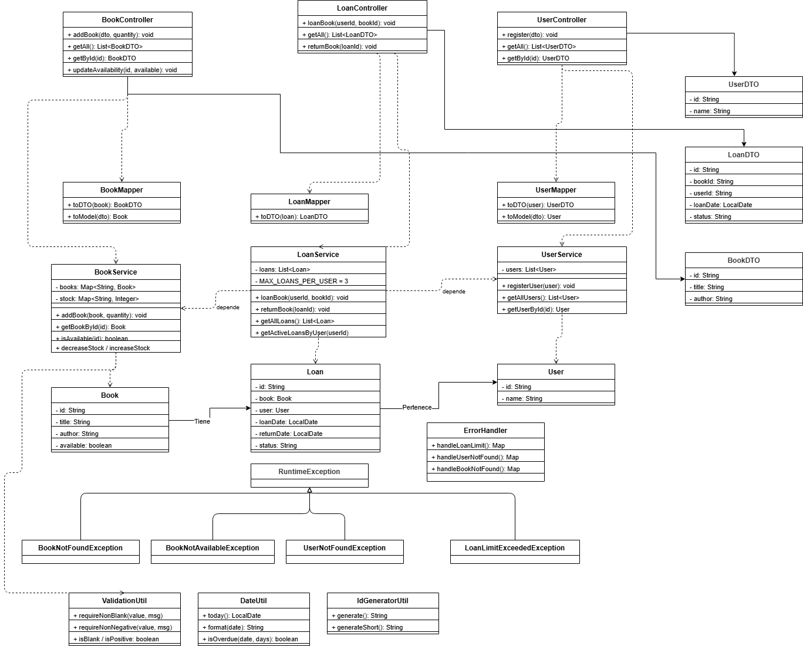
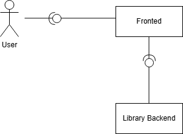
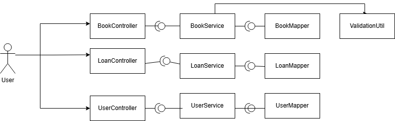
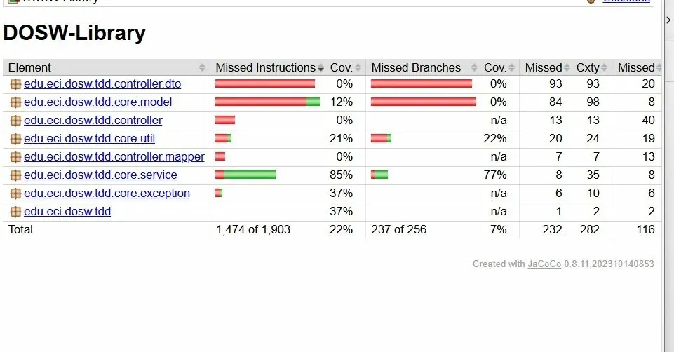
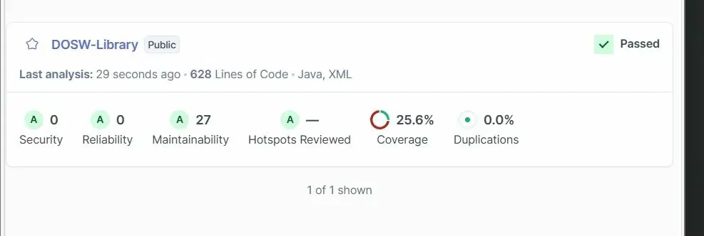
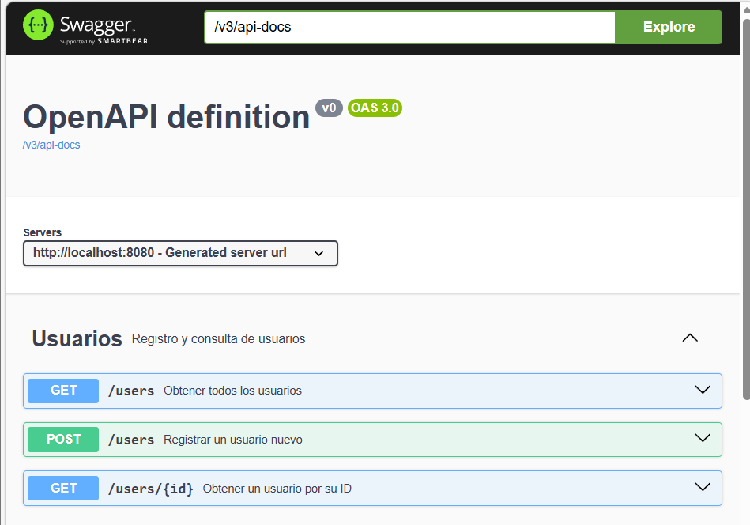
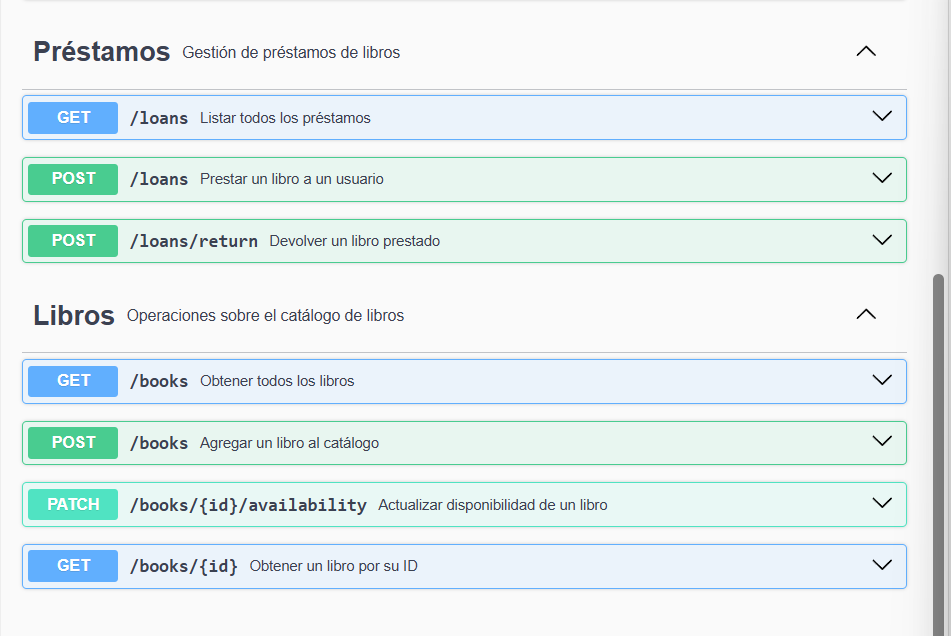
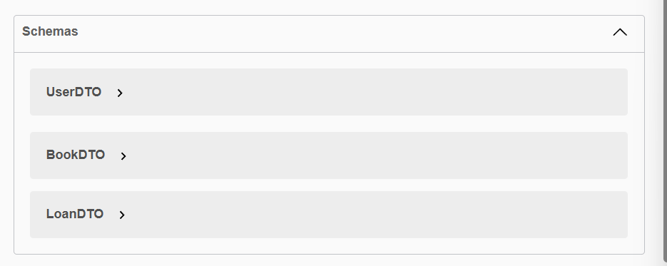

# DOSW-Library
El sistema permite a los usuarios consultar libros, registrarse y solicitar préstamos. El backend se encarga de verificar
que haya ejemplares disponibles, que el usuario exista y que no tenga más préstamos de los permitidos. 
Todo esto está a través de una API REST documentada con Swagger.

* # Arquitectura del proyecto
El proyecto sigue una arquitectura en capas, donde cada capa tiene una responsabilidad específica:

    * Controller: recibe las peticiones HTTP del usuario y las delega al servicio correspondiente
    * Service: contiene la lógica de negocio, como verificar disponibilidad de libros o el límite de préstamos
    * Model: representa las entidades del sistema: Book, User y Loan
    * DTO y Mapper: los DTOs son los objetos que se exponen en la API (lo que el cliente envía y recibe), y los mappers 
    convierten entre DTOs y modelos internos
    * Exception: contiene las excepciones personalizadas y el ErrorHandler que devuelve respuestas de error claras
    * Util: utilidades reutilizables para validaciones, fechas y generación de IDs
---
* # Diagrama de clases

Muestra todas las clases del sistema y sus relaciones. Los puntos más importantes son:

- Loan tiene una relación con Book y con User, porque un préstamo siempre pertenece a un usuario y a un libro
- LoanService depende de BookService y UserService para verificar datos antes de crear un préstamo
- ErrorHandler captura esas excepciones y devuelve respuestas HTTP con mensajes claros
- Las utilidades (ValidationUtil, DateUtil, IdGeneratorUtil) son clases independientes con métodos estáticos reutilizables
* # Diagrama de componentes General

Muestra la vista de alto nivel del sistema. El usuario interactúa con un Frontend, que se comunica con el Library 
Backend a través de una interfaz. Este diagrama representa cómo el sistema está dividido en dos grandes partes: 
la interfaz de usuario y el backend que procesa la lógica.

* # Diagrama de componentes especifico

Muestra en detalle cómo está organizado el backend internamente. El usuario llega a través de tres controladores 
(BookController, LoanController, UserController), cada uno conectado a su servicio correspondiente y a su mapper. 
También se muestra que ValidationUtil es compartida entre los servicios para reutilizar las validaciones.

* # Analisis cobertura jacoco

Para ejecutarlo: mvn test jacoco:report
  La cobertura total del proyecto es del 22%. El paquete con mayor cobertura es core.service con un 85%, que es el más
importante porque contiene la lógica de negocio principal del sistema (gestión de libros, usuarios y préstamos). 
Las pruebas unitarias se enfocaron en los servicios, que es donde reside la mayor complejidad del sistema.

* # Analisis cobertura SonarQube

Para Correrlo: mvn clean verify org.sonarsource.scanner.maven:sonar-maven-plugin:sonar "-Dsonar.projectKey=DOSW-Library"
"-Dsonar.projectName=DOSW-Library" "-Dsonar.host.url=http://localhost:9000" "-Dsonar.token=sqp_bbea077cf75fa30b9192968b509f381ef5caff66"

  * Los resultados obtenidos son 
  Seguridad en A: No hay vulnerabilidades en el código, como datos expuestos o entradas sin validar.
    Confiabilidad en A: No se encontraron bugs, es decir, el código no tiene errores que puedan hacer que el programa falle inesperadamente.
    Mantenibilidad en A: Hay 27 code smells, que son sugerencias de mejora pero no son errores. Por ejemplo, simplificar alguna condición o seguir mejor una convención de nombres.
    
    0% de duplicaciones: No hay código copiado y pegado, lo que muestra que el código está bien organizado.

* # SWAGGER API
Para correrlo: http://localhost:8080/swagger-ui/index.html

